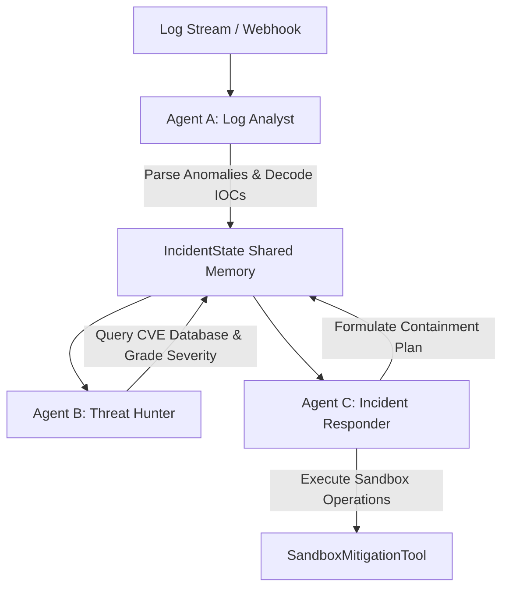

# AegisHunt: Automated Incident Response & Threat Hunting System

AegisHunt is a Python-based multi-agent security framework designed for Automated Incident Response and Threat Hunting. This project was developed as a 5-day capstone implementation utilizing a lightweight, custom async state machine orchestration pattern.

---

## 🛡️ System Architecture

AegisHunt coordinates three distinct security agents over a shared, validated memory state to analyze incoming logs, correlate threats against vulnerability databases, and safely orchestrate containment.



### 👥 Specialized Agents
1. **Agent A: Log Analyst & Triage Router** (`agents/log_analyst.py`):
   - Scans server log streams in real-time.
   - Detects patterns (SSH brute force, SQL injection, reverse shells).
   - Automatically decodes base64-obfuscated attack commands using heuristic decoders.
2. **Agent B: Threat Hunter & CVE Investigator** (`agents/threat_hunter.py`):
   - Takes threat indicators and resolves them against a local CVE threat intelligence database.
   - Maps vulnerabilities to MITRE ATT&CK techniques.
   - Computes the overall incident severity score (LOW, MEDIUM, HIGH, CRITICAL).
3. **Agent C: Incident Responder & Remediation Agent** (`agents/incident_responder.py`):
   - Builds containment scripts (e.g. adding `iptables` blocks, killing malicious processes).
   - Coordinates execution inside the mock Sandbox environment to safely protect the host network.
   - Automates escalations to human operators for CRITICAL alerts.

---

## ⚙️ Project Structure

```text
/agents/            # Agent logic definitions (Base, Analyst, Hunter, Responder)
/tools/             # Hardcoded mock tools (Logs generator, CVE intelligence, Sandbox)
/state/             # Pydantic schema model representing shared memory state
/eval/              # Red Team logs mutator and adversarial check suite
/tests/             # Pytest test cases validating the multi-agent pipeline
Dockerfile          # Isolated container deployment build
requirements.txt    # Library dependencies
main.py             # Event-loop daemon and FastAPI Webhook SOC Dashboard server
```

---

## 🚀 Setup & Installation

Ensure you have Python 3.11+ installed.

1. **Clone the repository and navigate inside**:
   ```bash
   cd Capstone_project
   ```

2. **Install dependencies**:
   ```bash
   pip install -r requirements.txt
   ```

---

## 💻 Running the System

### 1. Execute Adversarial Simulations (Red Team Mode)
Inject mutated and obfuscated threat logs directly into the agent pipeline to verify defense logic:
```bash
python main.py --mode simulate
```

### 2. Launch FastAPI Webhook Server & SOC Dashboard
Start the live uvicorn server serving the interactive Security Operations Center (SOC) dashboard:
```bash
python main.py --mode server --host 127.0.0.1 --port 8000
```
- Open **`http://127.0.0.1:8000/`** in your browser to view and interact with the SOC Console!
- Select attack templates (Mutated SQLi, B64 RevShell, SSH Brute Force), ingest them, and watch the agents run live in the dashboard.

### 3. Docker Deployment
Run the webhook receiver inside an isolated container network:
```bash
# Build the container
docker build -t aegishunt:latest .

# Launch the container
docker run -d --name aegishunt-worker -p 8000:8000 aegishunt:latest
```

---

## 🧪 Verification & Testing

Execute the test suite using pytest to verify agent pipeline integrity:
```bash
python -m pytest -v tests/test_agents.py
```
